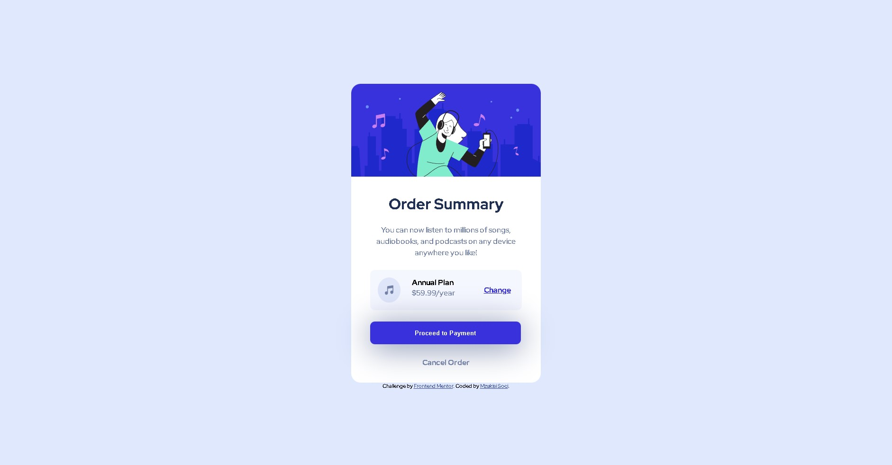

# Frontend Mentor - Order summary card solution

This is a solution to the [Order summary card challenge on Frontend Mentor](https://www.frontendmentor.io/challenges/order-summary-component-QlPmajDUj). Frontend Mentor challenges help you improve your coding skills by building realistic projects.

## Table of contents

- [Overview](#overview)
  - [The challenge](#the-challenge)
  - [Screenshot](#screenshot)
  - [Links](#links)
- [My process](#my-process)
  - [Built with](#built-with)
  - [What I learned](#what-i-learned)
  - [Continued development](#continued-development)
  - [Useful resources](#useful-resources)
- [Author](#author)

## Overview

### The challenge

Users should be able to:

- See hover states for interactive elements

### Screenshot




### Links

- Solution URL: [https://github.com/Mzu-Soci/Order-summary-card-solution.git](https://your-solution-url.com)
- Live Site URL: [Add live site URL here](https://your-live-site-url.com)

## My process

-Add html tags, divs, h1, p, button, a.
-Created css style sheet.
-Added and edited the image
-Edited fonts in text area (h1 and p)
-Edited pricing area background
-Added music-icon, h4, price-per-year, price-change, and formating
-Added payment button, filled color, padding and fonts
-Created a div to contain an anchor tag to cancel order.
-Added active states
-Added mobile media queries
-Added desktop media queries
-Added desktop virtical center alignment

### Built with

- Semantic HTML5 markup
- CSS custom properties
- Flexbox
- CSS Grid
- Mobile-first workflow

### What I learned

Learned how to center a div vertically for desktop site

To see how you can add code snippets, see below:

```css media query for desktop
body {
  height: 100vh;
  display: flex;
  align-items: center;
  justify-content: center;
}
```

### Continued development

Placing divs in the center of the page.

### Useful resources

- [Youtube](https://www.youtube.com/watch?v=QdITQ4upjME) - This helped me for with centering a div for desktop sites

## Author

- Website - [Add your name here](https://www.your-site.com)
- Frontend Mentor - [@yourusername](https://www.frontendmentor.io/profile/mzu-soci)
- Twitter - [@yourusername](https://www.twitter.com/yourusername)
